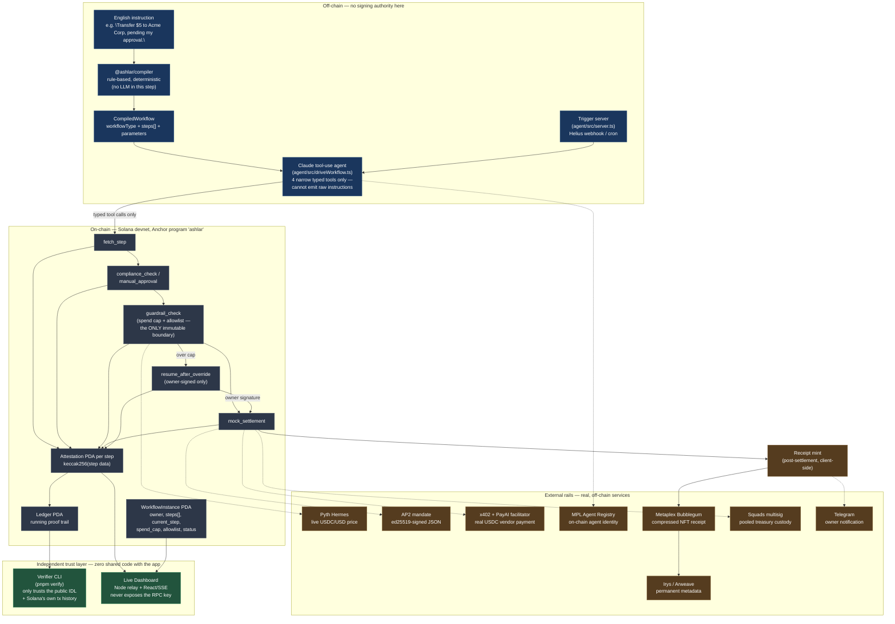

# Ashlar Architecture

A programmable financial workflow engine: English instructions compile to a fixed, on-chain
gate sequence that an AI agent can *drive* but never *bypass* — settlement authority lives entirely
in an immutable Solana program, not in the model.

## Reading the diagram

- **Blue (off-chain, no signing authority):** everything an attacker or a hallucinating model can
  reach. The compiler is deterministic; the agent's action space is 4 named, schema-constrained
  tools — it can request a step, never construct a transaction.
- **Gray (on-chain, immutable):** the only place spend-cap and allowlist enforcement actually
  lives. `guardrail_check` is the one gate nothing off-chain can talk around — confirmed
  empirically via the adversarial test suite (`pnpm adversarial-test`,
  `pnpm adversarial-agent-demo`).
- **Orange (external rails):** real, live third-party services this project integrates with
  rather than reimplements — Pyth pricing, x402/PayAI for vendor payment, MPL for agent identity,
  Bubblegum/Irys for the receipt, Squads for treasury custody, Telegram for notification.
- **Green (independent trust layer):** deliberately shares zero code with the app above it. The
  verifier only imports the public Anchor IDL and `@solana/web3.js`; the dashboard's relay holds
  the only RPC key and the browser never sees it.

## Why this proves "platform, not app"

The same compiler, the same 5-instruction on-chain program, and the same verifier handle two
structurally different compiled workflows today — `one-time-approval-gated-transfer`
(`[Fetch, ManualApproval, GuardrailCheck, MockSettlement]`) and `recurring-conditional-payment`
(`[Fetch, ComplianceCheck, GuardrailCheck, MockSettlement]`) — from one English sentence each, with
no code path specific to either use case. Both have real, independently-verified completed
settlements on devnet (see `demo/one-pager.md`).
